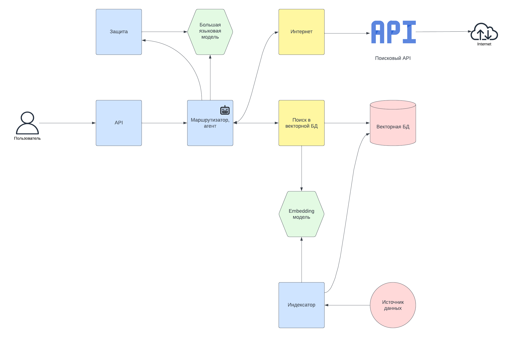

# Saint Highload++ 2024

Модульная RAG-система для Мастер-класса "Создание модульной (и желательно эффективной) RAG-системы" на конференции Saint Highload++ 2024.
Используется модель Yandex GPT, можно использовать любую другую модель. Возможно, потребуется переписывание промптов.

## Архитектура

Содержит следующие *внутренние* компоненты:

- Само приложение (`main.py`)
- Индексатор - (`rag/modules/index.py`)
- Агент (`rag/modules/agent.py`)
- Маршрутизатор (`rag/modules/route.py`)
- Поиск по базе знаний (`rag/modules/search.py`)
- Инструмент поиска в интернете (`rag/modules/internet.py`)

*Внешние* компоненты:

- Векторное хранилище - Weaviate Embedded
- LLM - Yandex GPT Pro
- Embedding - Yandex Embeddings

## Зависимости

- Git, Git LFS
- Python 3.12+
- [Poetry](https://python-poetry.org/)
- Ключ Brave Search API - можно использовать мой, который я выдам отдельно, или [зарегистрировать свой](https://api.search.brave.com/register)
- Ключ Yandex GPT API - можно использовать мой, который я выдам отдельно
- PostgeSQL

## Установка

    poetry install --no-root

## Настройка

Настройка производится через переменные окружения, их можно задать в локальном файле `.env`. 
Переменные читаются автоматически при запуске программы (в скобках - значения по умолчанию):

- `INDEX_NAME` (SaintHighLoad2024) - название индекса в Weaviate
- `DATA_PATH` (./data) - путь к папке с исходными данными
- `WEAVIATE_DATA_PATH` (./weaviate) - путь к папке, где Weaviate будет хранить данные
- `HYBRID_ALPHA` (0.5) - приоритет векторной части в гибридном поиске. Значение 0.5 - результаты семантического поиска и поиска по ключевым словам равнозначны.
- `WEAVIATE_SEARCH_TOP_K` (2) - максимальное количество результатов при поиске в Weaviate
- `CHUNK_SIZE` (1024) - размер чанка при разбиении исходных данных
- `CHUNK_OVERLAP` (20) - размер "перекрытия" при разбиении исходных данных
- `BRAVE_SEARCH_API_KEY` (none) - ключ Brave Search API
- `YANDEX_API_KEY` (none) - ключ Yandex API
- `YANDEX_FOLDER_ID` (none) - ID директории Yandex API

## Создание БД SQL

    CREATE DATABASE shl24;
    CREATE USER shl24 WITH ENCRYPTED PASSWORD 'shl24';
    GRANT ALL PRIVILEGES ON DATABASE shl24 TO shl24;

## Запуск

Индексация данных:

    python indexer.py

Запуск API:

    python main.py

## Очистка БД

1. "убить" процесс weaviate embedded, если он запущен
2. очистить папку `WEAVIATE_DATA_PATH`
